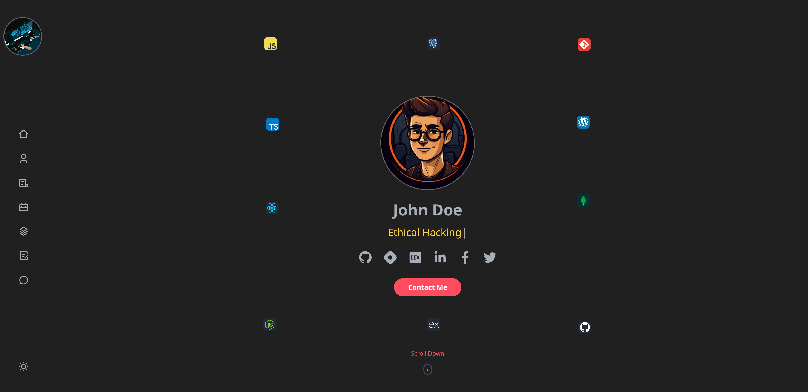

<h2 align="center">🧑 Portfolio Application 🎫</h2>

• 📢 Portfolio Web Site made with React, Node JS, NPM Packages "@emailjs/browser" for Send Email Directly From Your Code.

 

 
<h2 align="left">Live Preview: 🕹️ </h2>

    
• 🖥️  Portfolio Application&nbsp;
    
    

<h2 align="left">Languages and Tools : 🛠️ </h2>

    &nbsp;
    &nbsp;
    &nbsp;
    &nbsp;
    &nbsp;

<h2 align="left">Settings : ⚙️ </h2>

• 👷  In root folder "PortfolioApp-2" create new file ".env" with content: 

    
VITE_EMAILJS_SERVICE_ID = "EMAILJS_SERVICE_ID"   VITE_EMAILJS_TEMPLATE_ID = "EMAILJS_TEMPLATE_ID"   VITE_EMAILJS_PUBLIC_API_KEY = "EMAILJS_PUBLIC_API_KEY"

    
Create free account and then create email form for sending emails.  Website: https://www.emailjs.com

<!-- /////////////////////////////////////////////// MERN-Projects/PortfolioApp-2 ////////////////////////////////////////////////// -->